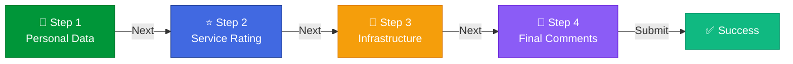

<!-- Hero Section -->
<div align="center">


<br><br>


<br>

**Patient satisfaction survey form for Brazil's Unified Health System (SUS)**

[🎯 About](#-about) • [✨ Features](#-features) • [🛠️ Technologies](#️-technologies) • [🚀 Quick Start](#-quick-start)

</div>

---


<!-- About -->
## 🎯 **About**

<table>
<tr>
<td width="60%">

### 🏥 **The Project**

A **patient satisfaction survey form** designed for Brazil's Unified Health System (SUS) with a **welcoming design** and **humanized language**.

The goal is to collect patient feedback about the care received at health facilities, enabling **continuous improvement** of healthcare services.

**Key Focus:**
- Patient-centric design
- Accessible interface
- LGPD compliance (Brazilian data protection law)
- Mobile-first approach
- Comprehensive validation

</td>
<td width="40%">


</td>
</tr>
</table>


<!-- Features -->
## ✨ **Features**

<div align="center">

### **4-Step Survey System**



</div>

### 📋 **Form Sections**

<table>
<tr>
<td width="50%">

#### **Step 1: Personal Data**
- 👤 Full name
- 🆔 CPF (with auto-formatting)
- 📞 Phone (with mask)
- 📧 Email (optional)
- 🏥 Health unit selection
- 📅 Appointment date

</td>
<td width="50%">

#### **Step 2: Service Rating**
- ⏰ Waiting time (visual cards)
- ⭐ Service quality (5-star rating)
- 😊 Staff professionalism (emoji scale)

</td>
</tr>
<tr>
<td width="50%">

#### **Step 3: Infrastructure**
- 🧹 Cleanliness & hygiene (1-10 scale)
- 🛋️ Facility comfort (1-10 scale)
- ✅ Available resources (checkboxes)

</td>
<td width="50%">

#### **Step 4: Final Comments**
- 💬 Free text feedback (1000 chars)
- 👍 Would recommend? (Yes/Maybe/No)
- 🔒 LGPD terms acceptance

</td>
</tr>
</table>


<!-- Validation -->
## ✅ **Validation System**

<div align="center">

### **Comprehensive Field Validation**

<table>
<tr>
<th>Field</th>
<th>Validation Rules</th>
<th>User Feedback</th>
</tr>
<tr>
<td>👤 <b>Name</b></td>
<td>Required, min 3 characters</td>
<td>Real-time error messages</td>
</tr>
<tr>
<td>🆔 <b>CPF</b></td>
<td>Valid algorithm verification</td>
<td>Auto-formatting: 000.000.000-00</td>
</tr>
<tr>
<td>📞 <b>Phone</b></td>
<td>10-11 digits complete</td>
<td>Auto-mask: (00) 00000-0000</td>
</tr>
<tr>
<td>📧 <b>Email</b></td>
<td>Valid email format (regex)</td>
<td>Pattern validation</td>
</tr>
<tr>
<td>📅 <b>Date</b></td>
<td>Cannot be future date</td>
<td>Date range restriction</td>
</tr>
<tr>
<td>⭐ <b>Ratings</b></td>
<td>All ratings required</td>
<td>Visual selection feedback</td>
</tr>
<tr>
<td>🔒 <b>LGPD Terms</b></td>
<td>Must be accepted</td>
<td>Mandatory checkbox</td>
</tr>
</table>

</div>

### 🔍 **Validation Features**

<table>
<tr>
<td width="50%">

#### **Client-Side**
- ✅ Real-time field validation
- ✅ CPF verification algorithm
- ✅ Email regex pattern matching
- ✅ Date range checking
- ✅ Required field highlighting
- ✅ Custom error messages

</td>
<td width="50%">

#### **User Experience**
- 🎯 Visual feedback on errors
- 📝 Auto-formatting masks
- 🔄 Progressive disclosure
- ⚡ Instant validation
- 💬 Helpful error messages
- ✨ Success indicators

</td>
</tr>
</table>


<!-- Technologies -->
## 🛠️ **Technologies**

<div align="center">

### **Pure Frontend Stack**

<table>
<tr>
<td align="center" width="33%">

### 📝 **Core**


**HTML5 Semantic**  
**CSS3 Modern**  
**Vanilla JavaScript ES6+**

</td>
<td align="center" width="33%">

### 🎨 **CSS Features**


**CSS Variables**  
**Flexbox & Grid**  
**Responsive Design**  
**Animations**

</td>
<td align="center" width="33%">

### ⚡ **JS Features**


**Event Listeners**  
**DOM Manipulation**  
**Form Validation**  
**Regex Patterns**

</td>
</tr>
</table>

### 📦 **No Dependencies**


</div>

### 🎯 **Technical Highlights**

<table>
<tr>
<td width="50%">

#### **CSS Techniques**
- CSS Custom Properties (Variables)
- Flexbox for layouts
- Grid for responsive design
- Media queries for breakpoints
- Transitions & animations
- Pseudo-elements styling

</td>
<td width="50%">

#### **JavaScript Features**
- Arrow functions
- Template literals
- Array methods (map, filter)
- Regular expressions
- Event delegation
- Local storage (optional)

</td>
</tr>
</table>


### 🎨 **Design System**

<div align="center">

| Element | Specification | Purpose |
|---------|--------------|---------|
| **Primary Color** | `#009639` | SUS official green |
| **Secondary Color** | `#0066CC` | Interactive elements |
| **Success** | `#10B981` | Positive feedback |
| **Error** | `#EF4444` | Validation errors |
| **Fonts** | Open Sans, Roboto | Readability |
| **Size** | 11KB compressed | Fast loading |

</div>


<!-- Quick Start -->
## 🚀 **Quick Start**

<div align="center">

### **Deploy in 2 Steps**

</div>

<table>
<tr>
<td width="33%" align="center">

### 1️⃣ **Clone**

```bash
git clone https://github.com/
joaogalimberti/
sus-satisfaction-survey.git

cd sus-satisfaction-survey
```


</td>

<td width="33%" align="center">

### 2️⃣ **Launch**

```bash
# Direct open
open index.html

# Or use server
python -m http.server
```


</td>
</tr>
</table>

### 🌐 **Deployment Options**

<div align="center">

| Platform | Setup | URL |
|----------|-------|-----|
| **GitHub Pages** | Push to `gh-pages` branch | `username.github.io/repo` |
| **Netlify** | Drag & drop folder | Auto-generated URL |
| **Vercel** | Connect GitHub repo | Auto-deployment |
| **Local Server** | `python -m http.server` | `localhost:8000` |

</div>


<!-- User Experience -->
## 👥 **User Experience**

<div align="center">

### **Accessibility & Usability**

</div>

<table>
<tr>
<td width="50%">

### ♿ **Accessibility**

- 📱 **Mobile-First**: Optimized for smartphones
- ⌨️ **Keyboard Navigation**: Full support
- 🎯 **Focus Indicators**: Clear visual feedback
- 📖 **Semantic HTML**: Screen reader friendly
- 🔤 **Large Text**: Readable font sizes
- 🎨 **High Contrast**: WCAG compliant

</td>
<td width="50%">

### 🎨 **User Interface**

- 🌊 **Progress Steps**: Visual journey
- ✅ **Instant Validation**: Real-time feedback
- 😊 **Emoji Ratings**: Engaging interaction
- ⭐ **Star System**: Intuitive scoring
- 🎯 **Visual Cards**: Easy selection
- 📝 **Character Counter**: Text field guidance

</td>
</tr>
</table>


<!-- LGPD Compliance -->
## 🔒 **LGPD Compliance**

<div align="center">

### **Data Protection & Privacy**

</div>

<table>
<tr>
<td width="50%">

### 📋 **Compliance Features**

- ✅ Explicit consent collection
- ✅ Clear data usage purpose
- ✅ Optional personal data fields
- ✅ Transparent processing information
- ✅ User rights notification
- ✅ Secure data handling

</td>
<td width="50%">

### 🛡️ **Security Measures**

- 🔐 Client-side only processing
- 📝 No automatic storage
- ✋ User consent required
- 🚫 No third-party tracking
- 📊 Minimal data collection
- 🔒 Privacy-first design

</td>
</tr>
</table>

<div align="center">


</div>


<!-- Use Cases -->
## 💼 **Use Cases**

<div align="center">

### **Where This Form Can Be Applied**

</div>

<table>
<tr>
<td width="33%" align="center">

### 🏥 **Health Clinics**

Basic health units (UBS)  
Patient satisfaction tracking

</td>
<td width="33%" align="center">

### 🏨 **Hospitals**

Emergency rooms  
Specialized care feedback

</td>
<td width="33%" align="center">

### 💉 **Vaccination Centers**

Campaign evaluation  
Service improvement

</td>
</tr>
<tr>
<td width="33%" align="center">

### 👨‍⚕️ **Specialized Clinics**

Dental, physiotherapy  
Quality assessment

</td>
<td width="33%" align="center">

### 🚑 **Emergency Services**

SAMU, urgent care  
Response evaluation

</td>
<td width="33%" align="center">

### 📊 **Research**

Academic studies  
Service quality analysis

</td>
</tr>
</table>


<!-- Contributing -->
## 🤝 **Contributing**

<div align="center">

**Help improve public healthcare feedback systems!**

</div>

<table>
<tr>
<td width="33%" align="center">

### 🐛 **Bug Reports**

Found an issue?  
Report it!

</td>
<td width="33%" align="center">

### 💡 **Suggestions**

Have ideas?  
Share them!

</td>
<td width="33%" align="center">

### 🔄 **Improvements**

Submit pull requests  
with enhancements

</td>
</tr>
</table>


<!-- Contact -->
## 📬 **Contact**

<div align="center">

### **Let's Connect!**

[](mailto:joaogalimberti@gmail.com)
[](https://www.linkedin.com/in/joaogalimberti/)
[](https://github.com/joaogalimberti)

</div>

---

<div align="center">


**Developed with 💚 by [João Galimberti](https://github.com/joaogalimberti) | 2025**

*Making healthcare feedback accessible and effective*

</div>
